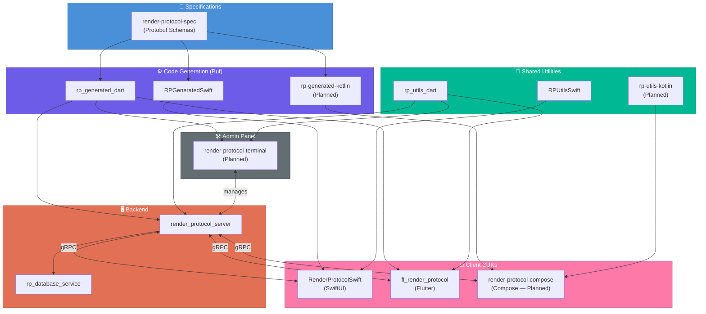

The goal is to enable **dynamic, schema-driven UIs** powered by backend configuration and AI systems — without sacrificing native performance or platform idioms.

> 🚧 This project is in **early foundation phase**.  
> Core schemas, architecture, client SDKs, and the backend server are being built out. Expect breaking changes during v0.x.

---

## 🎯 Vision

Build a **platform-agnostic UI rendering protocol** that allows:

- Rendering native UI from **Protobuf schema definitions**
- Backend-controlled UI updates without app redeploys
- AI systems (LLMs) to generate **valid, renderable UI schemas**
- Strong separation of **design, logic, and presentation**
- First-class support for **mobile-only experiences**

Render Protocol is **not a web abstraction layer** — it embraces native frameworks and performance.

---

## 🧠 Core Principles

- **Server-Driven, Native-Rendered**
- **Schema First** — Protobuf-defined, language-agnostic contracts
- **Mobile-Only Focus**
- **AI-Compatible UI Generation**
- **Open-Source & Self-Hostable**
- **Extensible & Incremental**

---

## 🔀 Architecture & Data Flow

---

## 📦 Repositories

### 📐 Schema & Specifications

| Repository | Description | Status |
|---|---|---|
| **[render-protocol-spec](https://github.com/renderprotocol/render-protocol-spec)** | Canonical Protobuf schemas — UI component definitions and gRPC API service contracts. Versioned (`v1`, `v2`) with Buf-managed code generation for Swift, Dart, Kotlin, C++, JS, and Python. | 🟢 Active |

---

### 🧩 Client SDKs

| Repository | Platform | Description | Status |
|---|---|---|---|
| **[RenderProtocolSwift](https://github.com/renderprotocol/RenderProtocolSwift)** | SwiftUI | Native Swift SDK with modular architecture — includes schema rendering, networking (gRPC), caching, state management, and component registries. Ships with an example app. | 🟢 Active |
| **[fl_render_protocol](https://github.com/renderprotocol/fl_render_protocol)** | Flutter | Flutter SDK mirroring the Swift architecture — widget rendering, networking, caching, and component registries. Includes an example app. | 🟢 Active |
| **[render-protocol-compose](https://github.com/renderprotocol/render-protocol-compose)** | Jetpack Compose | Kotlin/Compose renderer for Android. | 🔴 Not Started |

---

### ⚙️ Generated Code

| Repository | Language | Description | Status |
|---|---|---|---|
| **[RPGeneratedSwift](https://github.com/renderprotocol/RPGeneratedSwift)** | Swift | Auto-generated Swift Protobuf & gRPC stubs from `render-protocol-spec`. Consumed as a dependency by `RenderProtocolSwift`. | 🟢 Active |
| **[rp_generated_dart](https://github.com/renderprotocol/rp_generated_dart)** | Dart | Auto-generated Dart Protobuf & gRPC stubs from `render-protocol-spec`. Consumed by `fl_render_protocol` and `render_protocol_server`. | 🟢 Active |
| **rp-generated-kotlin** | Kotlin | Auto-generated Kotlin Protobuf & gRPC stubs for `render-protocol-compose`. | 🟠 Planned |

---

### 🧰 Shared Utilities

| Repository | Language | Description | Status |
|---|---|---|---|
| **[RPUtilsSwift](https://github.com/renderprotocol/RPUtilsSwift)** | Swift | Shared utility package — component factories, style resolvers, widget helpers, and action handlers for SwiftUI. | 🟢 Active |
| **[rp_utils_dart](https://github.com/renderprotocol/rp_utils_dart)** | Dart | Shared utility package — component factories, style resolvers, widget helpers, and action handlers for Flutter & server. | 🟢 Active |
| **rp-utils-kotlin** | Kotlin | Shared utility package for Jetpack Compose — component factories, style resolvers, and action handlers. | 🟠 Planned |

---

### 🖥️ Backend & Services

| Repository | Stack | Description | Status |
|---|---|---|---|
| **[render_protocol_server](https://github.com/renderprotocol/render_protocol_server)** | Dart (gRPC + Shelf) & Swift (gRPC + Vapor) | Backend reference implementation — gRPC & REST APIs, middlewares, mock data, and Docker support. Houses internal services like `rp_database_service`, with more upcoming. | 🟡 In Progress |
| **[render-protocol-terminal](https://github.com/renderprotocol/render-protocol-terminal)** | TBD | Admin panel for managing and configuring server-driven UIs. | 🔴 Not Started |

---

## 🗺️ Roadmap (High Level)

### Phase 1 – Foundations *(Current)*
- ✅ Define platform-generic UI schema in Protobuf (14 components, 4 API services)
- ✅ Set up Buf-managed code generation pipeline
- ✅ Client-side renderers for SwiftUI & Flutter
- ✅ Component registries and factory pattern
- 🔧 Networking, caching, and schema validation
- 🔧 Authentication handshake flow

### Phase 2 – AI & Tooling
- LLM-friendly schema definitions
- UI generation during user interaction
- Schema introspection & validation tools
- Drag-and-drop UI builder (backend-driven)

### Phase 3 – Ecosystem
- Jetpack Compose parity
- Admin panel for UI management
- Performance instrumentation
- Advanced state & event handling
- Terminal/CLI tooling

---

## 🤖 AI-First Thinking

Render Protocol is designed so that:

- An LLM can **reason about supported UI components**
- Generated responses can return **UI instead of text**
- Client SDKs can safely render AI-generated layouts

This enables:
- Conversational UIs
- Adaptive screens
- Context-aware layouts

---

## 🌱 Project Status

| Area | Status |
|---|---|
| Protobuf Schemas | ✅ v1 defined, v2 structure in place |
| Code Generation | ✅ Buf pipeline for Swift & Dart |
| SwiftUI SDK | 🟢 Active development |
| Flutter SDK | 🟢 Active development |
| Compose SDK | 🔴 Not started |
| Backend Server | 🟡 In progress |
| Database Service | 🟡 In progress |
| Admin Panel | 🔴 Not started |
| CLI Tooling | 🔴 Not started |

> APIs and folder structures are evolving — expect breaking changes during v0.x.  
> Contributions & discussions welcome once foundations settle.

---

## 🔗 Learn More

- GitHub Org: [github.com/renderprotocol](https://github.com/renderprotocol)
- Documentation *(upcoming)*: [rpdocs.karindam.in](https://rpdocs.karindam.in)

---

## 📜 License

This project is licensed under the **MIT License**. See the LICENSE file in each repository for details.
The intent is to keep Render Protocol **open, extensible, and community-friendly**.

---

**Render once. Control everywhere.**
